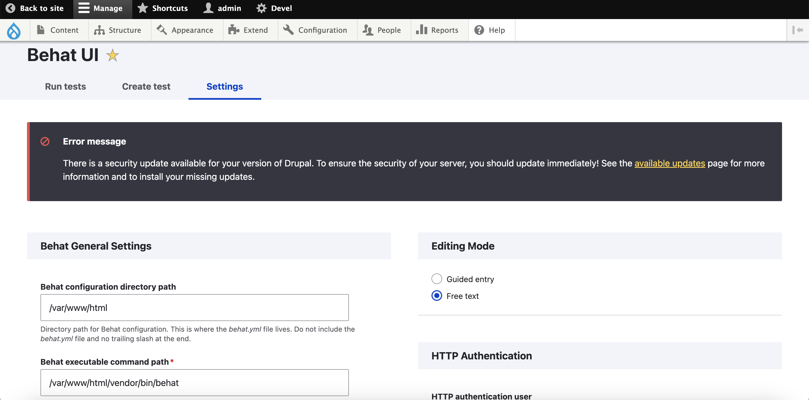
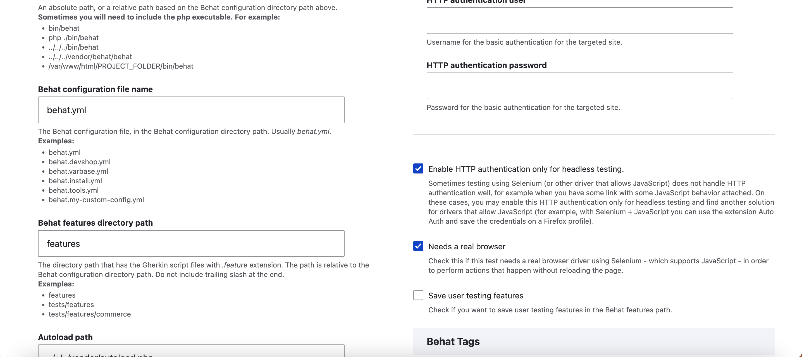
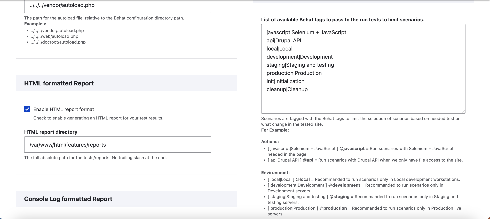
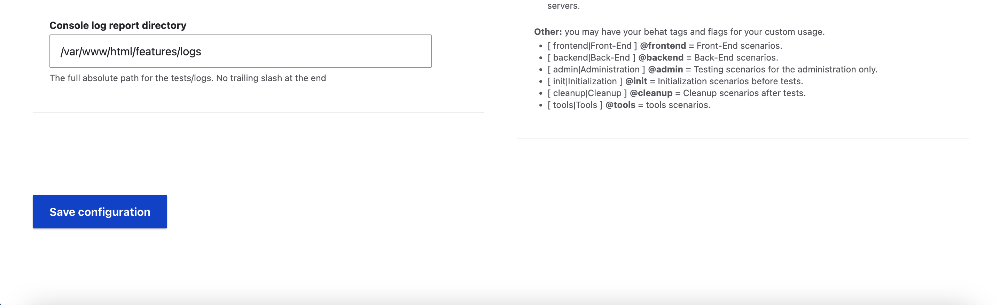

# Running acceptance tests in Drupal

This repository documents my first attempt how to run acceptance tests in Drupal using [bhat](https://behat.org/) (Gherkin-Style php testing framework for business expectations).

## Setup in a local DDEV environment

In this scenario the *api driver* is used for testing directly in a Drupal instance running locally on a developer machine using DDEV. 

For different scenarios (e.g. not testing directly in the drupal instance) different drivers are available (see [drivers overview](https://behat-drupal-extension.readthedocs.io/en/stable/drivers.html)) and other configuration steps are needed.

### Prerequisites

Install a new Drupal instance. You can find detailed instructions in the [quickstart section of the DDEV documentation](https://ddev.readthedocs.io/en/latest/users/quickstart/).

### Modules/packages/tools

When using acceptance testing in Drupal these libraries/packages come into play:

- [behat - php testing framework for business expectations](https://behat.org/)
- [mink - open source browser controller/emulator for web applications](https://mink.behat.org/en/latest/)
- [behat Drupal extension - contains step definitions for common Drupal scenarios](https://behat-drupal-extension.readthedocs.io/en/stable/intro.html)
    - installs behat and mink, tests can be run on the console
- [behat UI](https://www.drupal.org/project/behat_ui)
    - Graphical UI for running the tests in Drupal
    - installs behat, mink and behat drupal extension
- [behat Screenshot extension](https://github.com/drevops/behat-screenshot)
    - supports creating a screenshot when a test fails
    - supports creating a screenshot in a scenario step: `Then save screenshot`

### Example: Installation using behat UI

*behat ui* automatically installs behat, mink, and behat drupal extension. This allows to run tests either via shell or via the behat graphical UI. 

Some of the tests will be UI tests using the behat framework in combination with a selenium web driver. There are some scenarios where UI tests are helpful/valuable. However, it is highly recommended to respect the test pyramid and use behat primarily for testing business expectations (without testing the UI). Tests that are independent of the UI are less likely to change than UI tests (higher adoption rate, lower costs, less brittle, ...).

Note: In this example, the composer commands run outside of the Drupal container. Therefore the commands start with `ddev composer require` instead of `composer require`. As an alternative you can *ssh* into the container using `ddev ssh` and then run the composer commands directly (`composer require` instead of `ddev composer require`).

- Open a new terminal window
- Change into the folder of your newly created Drupal DDEV instance
- Install *behat UI*: `ddev composer require drupal/behat_ui`
- Install additional tools:
    - *behat html formatter* to generate a test results report in HTML: `ddev composer require --dev emuse/behat-html-formatter`
    - *behat screenshot* in order to capture screenshots: `ddev composer require --dev drevops/behat-screenshot`
- Install tools for browser automation/UI tests
    - Install selenium driver for browser automation: `ddev composer require behat/mink-selenium2-driver --dev`
    - Copy the following yaml files into your `.ddev` folder (e.g. `my-drupal9-site/.ddev`) to run a selenium container when using your local ddev installation: 
        - [docker-compose.selenium.yaml](.ddev/docker-compose.selenium.yaml)
        - [docker-compose.override.yaml](.ddev/docker-compose.override.yaml)
- Restart your ddev instance so that your newly configured selenium container will also run: `ddev restart`
- *ssh* into your container: `ddev ssh`
- Initialize behat: `behat --init` (this will create a folder features where you can store your tests)
- Close the *ssh* connection: `exit`
- Copy the *sample feature* (`sample.feature`) into the features folder (e.g. `my-drupal9-site/features`)

### Run the test on the shell

- *ssh* into the container: `ddev ssh`
- Run the test using the console output (default when using the provided `behat.yml` is the html formatter): `behat --format pretty`

### Enable behat screenshot extension

- For detailed usage instructions refer to the [behat Screenshot extension repository](https://github.com/drevops/behat-screenshot)
- Install extension: `ddev composer require --dev drevops/behat-screenshot`
- Edit `behat.yml`:
    - Add the screenshot context to the default contexts: 
      ```
      default:
        suites:
            default:
            contexts:
                - FeatureContext
                - DrevOps\BehatScreenshotExtension\Context\ScreenshotContext
      ```
    - Add the screenshot extension:
      ```
        extensions:
            DrevOps\BehatScreenshotExtension:
                dir: '%paths.base%/tests/screenshots'
                fail: true
                fail_prefix: 'failed_'
                purge: true
      ```
- Change the `sample.feature` so that it fails (e.g. alter the expected text so that it does not match)
- *ssh* into the container: `ddev ssh`
- Run the test using the console output: `behat --format pretty`
- Close the *ssh* connection: `exit`
- in the folder `tests/screenshots` (e.g. `my-drupal9-site/tests/screenshots`) you should see a .png file (screenshot of the failing step)

### Behat UI Configuration settings

The following screenshots show, how to configure *behat UI* in Drupal:

- Settings - part 1 of 4:    
  
- Settings - part 2 of 4:    
  
- Settings - part 3 of 4:    
  
- Settings - part 4 of 4:    
  
